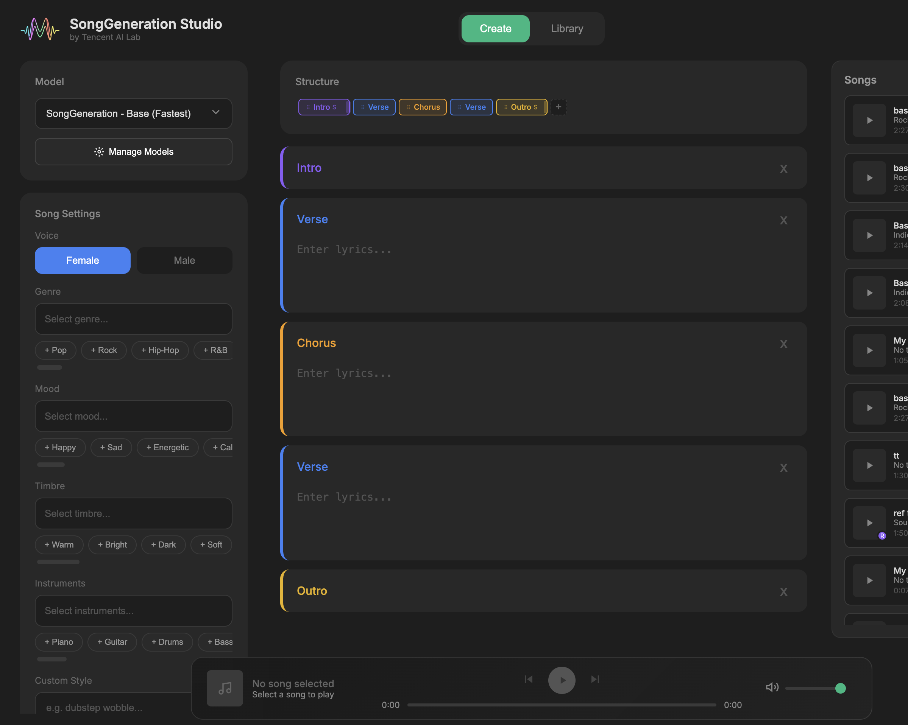

# Tencent SongGeneration Studio - Apple Silicon Edition 🍎
# SongGen-Mac - Generate music on Macs with Apple Silicon (M series chips)  with Duration Control.

  
   
  <b>The first fully functional, native Apple Silicon port of Tencent's SongGeneration.</b>
   
  <i>100% Local. No Cloud. No NVIDIA GPU Required.</i>

 

## ✨ What is Apple Silicon Edition?

This is a specialized fork of **SongGeneration Studio**, engineered to run on **Macs with any M series Apple Silicon chips **.

The original model requires massive NVIDIA GPUs. We have patched the entire dependency chain to translate CUDA instructions to **Metal (MPS)**, optimized memory usage to prevent crashes, and created a universal installer that works on any Silicon Mac.

 

## Screenshots

 

### 🍎 Mac-Specific Features
* **Native Metal (MPS) Support:** Runs completely on your Mac's Neural Engine & GPU.
* **Smart Memory Management:** Dynamically detects your RAM (16GB vs 64GB) to prevent crashes.
* **Base & Large Model Support:** Choose between speed (>=6 mins for ~2 min song) or maximum quality (>=12 mins for ~2 min song).
* **Universal Compatibility:** Tested on M1 Max 64gb, Mac OS 15.7.2 Sequoia. Compatible with all M series chips.

---

## 💻 Requirements

**⚠️ Critical:** This runs locally on your Mac. Your hardware determines your performance.

| Component | Minimum (Base Model) | Recommended (Large Model) |
| :--- | :--- | :--- |
| **Chip** | M1 / M2 / M3 (Base/Pro) | M1 / M2 / M3 / M4 (Max/Ultra) |
| **RAM** | **16 GB** | **32 GB+** (64GB Preferred) |
| **OS** | macOS 14 (Sonoma) | macOS 15+ (Sequoia) |
| **Storage** | 15 GB Free | 70 GB Free (due to Swap usage) |
| **Generation Time** | ~4-6 minutes | ~10-25 minutes |

> **❌ 8GB RAM Users:** The "Large" model is **not supported** and will crash your system. You can attempt the "Base" model, but expect heavy slowness/system freeze.
> **⚠️ Due to the model architecture(and inefficiency of apple mps), the total app ram usage(including swap) hits around 70gb during inference(for the fastest base model), so expect heavy swap usage for devices with <32gb memory. Large model goes around 80gb usage...

---

## 📦 Installation (One-Click)

This app is designed to be installed via **Pinokio**, the AI browser.

1.  **Download Pinokio:** [pinokio.computer](https://pinokio.computer)
2.  **Copy this Repository URL:** (Paste your GitHub URL here)
3.  **Paste into Pinokio:** Open Pinokio, paste the URL into the search bar, and hit Enter.
4.  **Click Install:**
    * The installer will automatically detect your Mac chip.
    * It will fetch the initial model weights (~15GB). (the main song models, base or large, are to downloaded later from the UI)
    * It will patch all Python libraries (`librosa`, `torchcodec`, `flash-attn`) for Mac compatibility.

That's it! No terminal commands needed. ✅

---

## 🚀 How to Use

### 1. Choosing Your Model
When you launch the app, check the "Model" dropdown:
* **SongGeneration-Base(fastest):** Best for **32GB Macs** or quick drafts (~6 mins for ~2 mins of song).
* **SongGeneration-Large:** Best for **48GB+ Macs** and final production (~12 mins for ~2:30 mins of song). **Higher memory usage.**

### 2. Creating a Song
1.  **Lyrics:** Write your own or use an LLM to generate lyrics with structure (Verse, Chorus, Bridge).
2.  **Style:** Select "Female" or "Male" voice, and pick a Genre.
3.  **Generate:** Click **Create** and wait.
    * *Note: The progress bar may pause at 10% or 90% while the model loads/unloads. This is normal.*

### 3. Using Reference Audio (Style Cloning)
You can upload an MP3/WAV to clone its vibe (15 secs max, will be cut after upload).
* **⚠️ Important:** The Reference Audio acts as the "Boss." If you upload a ** low pitch piano instrumental**, the AI might ignore your "Female Voice" setting and give you a low Male voice to match the piano's pitch.
* **💡 The Fix:** If this happens, add specific tags to the start of the **Custom Style** box, like :  
    `"Female Vocals, High Pitch, Woman Singing"`

---

## 🐛 Troubleshooting & Known Issues

* **Heavy Swap Usage (Disk Space Warning):**
    * The "Large" model is massive. During generation, **you may see 30GB - 40GB of Swap usage**, even on 64GB Macs(totals around 80gb+ ram+swap during inference for me).
    * Ensure you have at least **60GB of free disk space** before running the Large model, or the OS may freeze.
* **System Sluggishness:**
    * While generating, the AI uses nearly 100% of your system resources. It is normal for other apps to lag.

---

## 🙏 Credits

* **Original Model:** [Tencent AI Lab (SongGeneration)](https://github.com/tencent-ailab/SongGeneration)
* **Studio Interface and original code:** [BazedFrog](https://github.com/BazedFrog/SongGeneration-Studio)
* **Apple Silicon Port:** [Rdx-ai-art]
* **Pinokio:** [pinokio.computer](https://pinokio.computer)

---

## 📄 License

This launcher is provided for personal, educational, and research purposes. See the original [SongGeneration repository](https://github.com/tencent-ailab/SongGeneration) for model licensing details.

  <i>Made with ❤️ for Mac Musicians</i>

